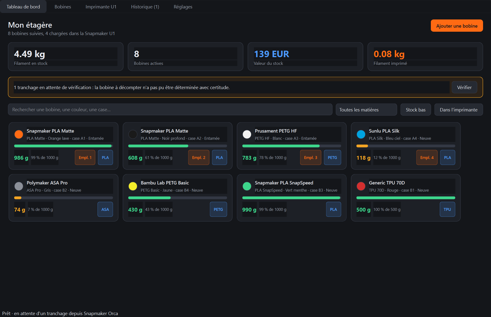

# Spool Manager

**Français** | [English](README.en.md)

Filament inventory for Snapmaker Orca, Orca Slicer and Bambu Studio.
Full English documentation: [README.en.md](README.en.md).

Gestion du stock de filament couplée à **Snapmaker Orca**, **Orca Slicer** et
**Bambu Studio**. Vous saisissez les bobines posées sur votre étagère ; à chaque
tranchage, l'application récupère le grammage consommé et le décompte automatiquement
de la bonne bobine.

Conçue pour la **Snapmaker U1** et la **Bambu Lab A1 mini**, elle fonctionne aussi
avec une autre imprimante (le nombre d'emplacements est alors réglable).



## Comment ça marche

Snapmaker Orca sait exécuter un script au moment où il écrit un fichier G-code. Ce
script lit les statistiques inscrites dans le G-code et dépose un petit fichier dans une
boîte de réception. L'application, résidente dans la zone de notification, le récupère,
identifie les bobines concernées et met le stock à jour.

```
Orca exporte  ->  hook  ->  boîte de réception  ->  application  ->  stock à jour
```

Le déclencheur dépend de l'imprimante. Pour une **Bambu** (A1 Mini, X1…), Orca exécute
le hook dès le tranchage. Pour la **Snapmaker U1**, Orca ne l'exécute qu'à l'export du
G-code (`Fichier → Exporter → Exporter le G-code`). L'application surveille aussi le
dossier temporaire d'Orca, pour décompter un tranchage U1 dès que l'aperçu est prêt.

Le hook ne modifie jamais votre G-code et ne peut pas faire échouer un tranchage : en
cas de problème, il écrit dans son journal et se termine normalement.

La lecture du G-code est verrouillée sur deux exports réels de Snapmaker Orca 2.3.5 pour
la U1, une couleur et deux couleurs avec tour de purge, conservés dans
`tests/fixtures`. Le grammage est recoupé avec le volume et la masse volumique annoncés
par Orca. Le filament de purge des changements d'outil est déjà compris dans le
grammage de chaque filament : rien n'échappe au décompte.

### Attribution automatique des bobines

Pour chaque filament du tranchage, l'application note les bobines candidates :

| Indice | Poids |
| --- | --- |
| Bobine déclarée dans le même emplacement d'imprimante | très fort |
| Profil filament Orca identique | fort |
| Couleur identique | moyen |
| Marque identique | faible |
| Matière différente | éliminatoire |

Le décompte est appliqué **sans confirmation** quand une bobine se détache nettement des
autres. En cas d'ambiguïté, de matière absente du stock ou de stock insuffisant, le
tranchage part dans une file « à vérifier » et rien n'est décompté tant que vous n'avez
pas tranché. Chaque décompte reste annulable depuis l'historique.

Renseigner les emplacements dans l'onglet **Imprimante** est ce qui rend
l'attribution quasi certaine : le G-code indique quel emplacement est consommé.

## Installation

### Installeur Windows (recommandé)

Téléchargez `SpoolManager-1.0.2-Setup.exe` depuis les [releases GitHub](https://github.com/Tellus75/spool_manager_U1/releases)
et lancez-le. L'application s'installe dans votre profil Windows, sans droits
administrateur, puis crée un raccourci dans le menu Démarrer.

Au premier lancement, allez dans **Réglages** et cliquez sur **Installer le hook sur
tous mes profils**, Snapmaker Orca étant fermé. La langue de l'interface (français
ou anglais) se choisit dans le même onglet.

### Depuis l'exécutable (sans installeur)

1. Copiez le dossier `SpoolManager` où vous voulez, par exemple dans `C:\Program Files`.
2. Lancez `SpoolManager.exe`.
3. Allez dans **Réglages** et cliquez sur **Installer le hook sur tous mes profils**,
   Snapmaker Orca étant fermé.

Aucun Python n'est nécessaire.

### Depuis les sources

```powershell
pip install -r requirements.txt
python run.py
```

Pour reconstruire l'exécutable et l'installeur :

```powershell
pip install -r requirements-dev.txt
powershell -ExecutionPolicy Bypass -File tools/build_installer.ps1
```

L'installeur se trouve alors dans `installer\output`. Un tag Git `v1.0.2` déclenche
aussi la construction sur GitHub Actions.

Le résultat est dans `dist/SpoolManager`.

## Brancher le hook dans Orca

L'écran **Réglages** pose le hook automatiquement, mais il faut comprendre une limite
d'Orca : les scripts de post-traitement sont un réglage **du profil d'impression**, pas
un réglage global. Il n'existe aucun endroit où le déclarer une fois pour toutes.

L'application écrit donc le hook dans tous vos profils d'impression **personnels**. Elle
ne touche pas aux profils système, qu'Orca réécrit à chaque mise à jour. Si vous tranchez
avec un profil système (par exemple `0.20 Standard @Snapmaker U1`), dupliquez-le d'abord
dans Orca avec l'icône d'enregistrement à côté du nom du profil, puis revenez cliquer sur
**Actualiser**.

Fermez Orca avant d'installer le hook : Orca réécrit ses profils en quittant et
annulerait la modification. L'application vous prévient s'il est ouvert.

Pour une pose manuelle, copiez la commande affichée dans les Réglages et collez-la dans
Orca sous **Réglages d'impression > Autres > Scripts de post-traitement**.

### Filet de sécurité

Si un profil n'est pas équipé du hook, activez la **surveillance de dossier** dans les
Réglages en désignant le dossier où vous exportez vos G-code. L'application y détecte les
nouveaux fichiers et les décompte de la même manière. Un fichier déjà vu n'est jamais
recompté, et les fichiers présents au démarrage sont ignorés pour éviter de décompter
rétroactivement d'anciennes impressions.

## Utilisation

### Saisir vos bobines

Depuis **Ajouter une bobine**, le bouton **Importer un profil…** récupère la marque, la
matière, la densité et le prix depuis les profils filament de votre installation Orca,
ce qui évite de tout retaper.

Deux poids sont demandés et ils ne servent pas à la même chose. Le **poids net à l'achat**
est la référence de la jauge de remplissage. La **tare** est le poids de la bobine vide,
utilisée lors des pesées.

Associer le **profil Orca** à la bobine améliore nettement l'attribution automatique si
vous ne tenez pas les emplacements à jour.

### Recaler par pesée

Le décompte théorique dérive toujours : purges, ratés, restes de bobine. Posez la bobine
entière sur une balance, saisissez le poids affiché dans **Peser…**, et l'application
retire la tare pour recalculer le restant. La pesée fait foi et l'écart est enregistré
comme un mouvement, donc l'historique reste cohérent.

### Historique et annulation

Chaque tranchage est listé avec le détail par bobine. **Annuler le décompte** restitue
exactement les grammes retirés. Rien n'est jamais écrasé : le restant d'une bobine est
toujours la somme de ses mouvements, ce qui rend l'historique vérifiable.

## Où sont mes données

Tout est dans `%APPDATA%\SpoolManager` :

| Élément | Contenu |
| --- | --- |
| `spoolmanager.db` | base SQLite : bobines, tranchages, mouvements |
| `inbox` | tranchages transmis par le hook, en attente de traitement |
| `inbox-traites` | tranchages déjà intégrés, conservés pour diagnostic |
| `logs\orca_hook.log` | journal du hook, à consulter si un tranchage n'arrive pas |

Sauvegarder `spoolmanager.db` suffit à sauvegarder tout votre inventaire.

## Si un tranchage n'est pas décompté

1. Pour la U1 : Spool Manager doit tourner pendant le tranchage (il lit le G-code
   temporaire). Sans l'application ouverte, exportez le G-code ou relancez-la ensuite.
2. L'application tourne-t-elle ? Elle doit rester dans la zone de notification. Sinon,
   les tranchages sont rattrapés au prochain démarrage, rien n'est perdu.
3. Le profil d'impression utilisé est-il coché dans les Réglages ?
4. Que dit `logs\orca_hook.log` ? Une ligne y est écrite à chaque passage du hook
   (Bambu au tranchage, U1 à l'export).
5. Le dossier `inbox` contient-il des fichiers non consommés ?

## Vérifier la lecture d'un G-code

Le format d'en-tête d'Orca peut changer d'une version à l'autre. Pour contrôler qu'un
tranchage est lu correctement, sans rien décompter :

```powershell
python tools/validate_gcode.py "C:\chemin\vers\piece.gcode"
python tools/validate_gcode.py                 # prend le G-code le plus récent
python tools/validate_gcode.py piece.gcode --match   # simule aussi l'appariement
```

L'outil affiche le grammage par emplacement, recoupe les chiffres annoncés avec ceux
qu'il recalcule (somme des filaments, volume multiplié par la masse volumique) et
signale toute clé `filament*` inattendue. Un rapport sans incohérence signifie que le
décompte automatique portera sur les bons chiffres.

## Développement

```powershell
python -m pytest tests -q          # suite complète
python tools/check_orca.py         # diagnostic de l'intégration Orca
python tools/validate_gcode.py     # contrôle du parseur sur un vrai G-code
python tools/make_fixture.py a.gcode tests/fixtures/b.gcode  # empreinte de test allégée
python tools/render_preview.py     # capture chaque onglet dans docs/apercu
```

Les tests d'interface tournent hors écran et n'ouvrent aucune fenêtre.

### Organisation

| Fichier | Rôle |
| --- | --- |
| `spoolmanager/gcode_parser.py` | lecture des statistiques dans le G-code Orca |
| `spoolmanager/matching.py` | notation et choix de la bobine |
| `spoolmanager/inventory.py` | mouvements de stock, décompte, annulation |
| `spoolmanager/orca.py` | profils filament et pose du hook |
| `spoolmanager/watcher.py` | boîte de réception et surveillance de dossier |
| `spoolmanager/hook_runner.py` | logique du script de post-traitement |
| `hook/orca_hook.py` | enveloppe appelée par Orca |
